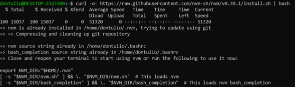
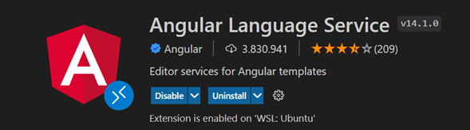

# Preparación de ambiente de desarrollo
Para poder trabajar con **Angular** y **Ionic** es necesario instalar **Node**, el cual, es un entorno de desarrollo para javascripts fuera del navegador. 

Al momento de trabajar con **Nodejs** eventualmente necesitaremos trabajar con diversas versiones de este, y este proceso se puede volver muy tediosos cuando tenemos muchos proyectos que corren diferentes versiones de node, ya sea por las dependencias o restricciones del proyecto.

Para ello, instalaremos la herramienta Node Version Manager por sus sigas **NVM** el cual, nos permitirá gestionar las diversas versiones de Nodejs que tengamos, con un archivo llamado **“.nvmrc”** que crearemos junto a nuestro proyecto. El cual definirá la versión de Nodejs que requiere para funcionar.

Podemos instalar dicha herramienta siguiente los siguientes pasos:


## Instalar NVM Windows 

### Paso 1

Descargar **NVM** para Windows del siguiente repositorio https://github.com/coreybutler/nvm-windows/releases procurar bajar la última versión disponible para Windows en el archivo llamado “nvm-setup.exe”

### Paso 2

Una vez descargado, procederemos a instalarlo, acetando los acuerdos y condiciones para después darle siguiente, siguiente, hasta que termine el proceso.
En caso de abrir un recuadro emergente, darle aceptar, para proceder con la instalación.

### Paso 3

Verificar la instalación usando el CMD nuevo, deberá ejecutar el siguiente comando:
```CMD
nvm version
```
con el comando deberá mostrar la versión de la herramienta por el CMD


Con dicha herramienta instalada ya estamos listos para poder gestionar nuestras versiones de node.

## Instalar NVM Linux
### Paso 1
Para poder descargar la versión para **Linux**, necesitamos la herramienta **CURL** o **WGET** respectivamente y lo pueden instalar, siguiente el siguiente comando (distribuciones basas en Debian).
```bash
apt-get update # recomendado
apt-get install wget -y # para instalar wget
apt-get install curl -y # para instalar curl
```

### Paso 2

Dirigirse al siguiente repositorio https://github.com/nvm-sh/nvm#installing-and-updating y copiar el script de descargar y ejecución de tu herramienta preferida **curl** o **wget**




### Paso 3

Una vez descargado, copiar y pegar el siguiente script en tu **.bashrc** o **.profile** o **.zshrc** o **.bash_profile**

```bash
export NVM_DIR="$([ -z "${XDG_CONFIG_HOME-}" ] && printf %s "${HOME}/.nvm" || printf %s "${XDG_CONFIG_HOME}/nvm")"
[ -s "$NVM_DIR/nvm.sh" ] && \. "$NVM_DIR/nvm.sh" # This loads nvm
```
En este ejemplo modificare con el editor **nano**

```bash
nano ~/.bashrc
```
El final de mi archivo


Una vez modificado, usaremos el comando **source** para recargar nuestras variables de entorno

```bash
source ~/.bashrc
```


### Paso 4
Para verificar nuestra instalación solo ejecutamos el comando **nvm** con el flag **version**.


---

## Instalar node

### Windows

Para instalar node con nvm en Windows ejecutaremos el siguiente comando.

```bash
nvm install lts
```

Con esto instalaremos la última versión con soporte a largo plazo (LTS)


Una vez descargado, procederemos a ejecutar el comando que nos muestra en un nuevo CMD como administrador.
```bash
nvm use <version>
```
* Reemplazar <version> con la versión que nvm acaba de instalar.


Con esto, ya tenemos **node** instalado y podemos comprobarlo preguntando su versión, con el comando 
```bash
node --version
```


### Linux

Con la herramienta configurada en **Linux** procederemos a instalar la versión de soporte a largo plazo (**LTS**) con el siguiente comando

```bash
nvm install –lts
```
en **Linux**, descargará y usará la versión automáticamente


Por lo tanto, podemos comprobar la instalación con el comando

```bash
node --version
```


## Instalar Angular

**Estos pasos a continuación son para Windows y Linux**

Al momento que se instala **node**, se instala una herramienta llamada **NPM** (Node Package Manager), el cual, nos sirve para instalar dependencias de forma global, para desarrollo o de nuestros proyectos, podemos comprobar la versión instalada, con el siguiente comando.

```bash
npm --version
```


Se puede actualizar la herramienta, con el siguiente comando:

```bash
npm install -g npm@latest
```

Para instalar **Angular**, lo podemos hacer con el siguiente comando.

```bash
npm install -g  @angular/cli
```

Una vez finalizado, podemos comprobar la instalación con el siguiente comando.

```bash
ng version
```


Se desplegará toda la información sobre el **Angular CLI** y dependencias que se instalaron en conjunto.

## Instalar extensiones necesarias en vscode

Para trabajar con angular, se recomienda instalar las siguientes extensiones en Visual Studio Code, el cuales son las siguientes:

1. Angular Language Service<br>
   
2. EditorConfig for VS Code<br>
   
   
El cual, el primero nos servirá para entregarnos autocorrección en nuestros componentes y ayudas útiles al momento de codificar, y el segundo nos obligará a mantener una sintaxis similar entre los integrantes del proyecto.
