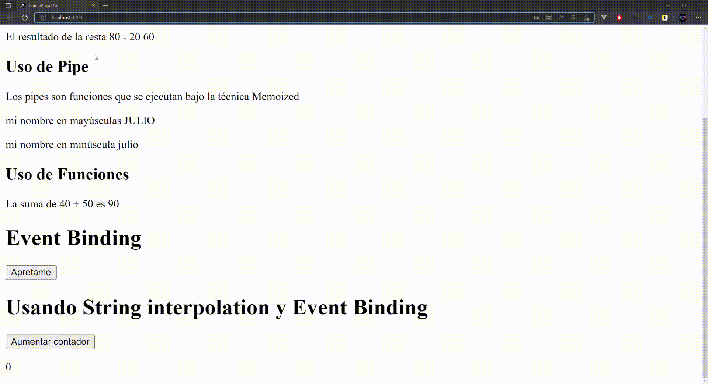

# Creando el primer proyecto

Para crear un nuevo proyecto de Angular, debes ejecutar el siguiente comando en un CMD:
```bash
ng new <nombre>
```
* Reemplazar <**nombre**> por el nombre de tu proyecto.

Al ejecutar este comando, automáticamente se creará una carpeta con el <**nombre**> elegido, como también, se hará el primer **commit** del proyecto al momento de finalizar.

Este último paso se puede omitir con el flag **skip-git**, puedes obtener más información sobre los **flags** opcionales que puede ser pasados a este comando en el siguiente enlace: https://angular.io/cli/new
```bash
# crear un proyecto omitiendo el git
ng new <nombre> --skip-git
``` 
* Reemplazar <**nombre**> por el nombre de tu proyecto.
  


Una vez que se ejecute dicho comando, el CLI hará dos preguntas.

1. ¿Quieres añadir Angular routing al proyecto? Y / n <br>
   
2. ¿Qué tipos de hojas de estilos quieres usar, CSS, SCSS, SASS, LESS?<br>
   

**Para este ejemplo se responderá Y para Angular routing y SCSS para las hojas de estilo, y comenzará la creación del proyecto.**


Una vez terminado, podrán ver una nueva carpeta con el nombre del proyecto.


Dicha carpeta la pueden abrir con su editor de texto preferido, en este caso será con Visual Studio Code (VSCode)

Una vez abierto, verán todos los archivos y carpetas que tiene tu proyecto:


Nosotros trabajaremos dentro de src en donde encontraremos el punto de arranque de nuestro proyecto, index.html, estilos globales (style.scss), y la carpeta de nuestro primer módulo llamado app y ahí estará nuestro primer componente llamado app.component que es donde trabajaremos.


Hay que mencionar que un componente es un bloque de código que encapsula una estructura HTML, estilos CSS y una funcionalidad JS (Typescript en nuestro caso al trabajar con Angular), el cual, nos ayudará a crear elementos reutilizables a lo largo de nuestra aplicación web.

Si miramos nuestro archivo llamado “app.component.ts” veremos la siguiente estructura:


En donde veremos lo siguiente:

* La propiedad “selector” nos ayuda a determinar el nombre de la etiqueta de invocación para este componente.
* La propiedad “templateUrl” definiremos en donde está el archivo HTML de este componente.
* La propiedad “styleUrls” definiremos los posibles archivos CSS que tendrá este componente.
* La clase que esta siendo decorada, es nuestra funcionalidad, el cual, se codifica en TypeScript que es una capa que va sobre JavaScript para darle tipos y tener una ayuda al momento de codificar.

Al ser una clase, hay que recordar que una Clase está formada por:

* Atributos
* Métodos

## String Interpolation

El String interpolation consisten en usar “{{  }}” para pintar por pantalla los atributos y métodos ( que retornen ) en nuestra plantilla de HTML que esta enlazada en nuestro componente, dentro de esta interpolación se ejecuta JavaScript, pero hay que tener cuidado, ya que el foco principal de esta característica es pintar por pantalla y no hacer ejecuciones complejas, podemos sumar, restar, multiplicar, dividir, llamar atributos, llamar funciones, etc. Operaciones no complejas.

Al tener este enlace Angular, en su defecto también reactividad, ¿qué significa esto?, si nuestro elemento desde el TS cambia, también, lo hará en la plantilla en donde se está llamando.

```typescript
// Archivo app.component.ts
import { Component } from '@angular/core';

@Component({
  selector: 'app-root',
  templateUrl: './app.component.html',
  styleUrls: ['./app.component.scss']
})
export class AppComponent {
  public nombre: string = 'Julio';
}

```

```html
<!-- Archivo app.component.html -->
<p>Llamando el atributo nombre desde nuestro ts</p>
<p>Mi nombre es {{ nombre }}</p>
<p>El resultado de la suma 80 + 30 {{ 80 + 30}}</p>
<p>El resultado de la resta 80 - 20 {{ 80 - 20 }}</p>

```
De esta manera integramos nuestros atributos de nuestro archivo TS a nuestro HTML.

### Uso de Pipes dentro de String Interpolation

También podemos usar algunos Pipes que vienen por defecto, el cual son funciones, que se ejecutan bajo la técnica de Memoized, que guarda el valor una vez ejecutado y si el resultado es el mismo no se vuelve a ejecutar. (También podemos crear nuestras propias Pipes y usar la técnica de optimización llamado Pure Pipe Functions).

```html
<!-- Archivo app.component.html -->
...
<h2>Uso de Pipe</h2>
<p>Los pipes son funciones que se ejecutan bajo la técnica Memoized </p>
<p>mi nombre en mayúsculas {{ nombre | uppercase }} </p>
<p>mi nombre en minúscula {{ nombre | lowercase }} </p>
```
En los ejemplos anteriores, podemos agregarle la acción de poner todo en mayúsculas o en minúsculas usando los pipes **uppercase** o **lowercase** correspondientemente, hay otros pipes que vienen por defecto en angular el cuales son los siguientes:

| Clase del Pipe | Invocación | Más información sobre parámetros                                                           |
| -------------- | ---------- | ------------------------------------------------------------------------------------------ |
| DatePipe       | date       | [https://angular.io/api/common/DatePipe](https://angular.io/api/common/DatePipe)           |
| UpperCasePipe  | uppercase  | https://angular.io/api/common/UpperCasePipe                                                |
| LowerCasePipe  | lowercase  | [https://angular.io/api/common/LowerCasePipe](https://angular.io/api/common/LowerCasePipe) |
| CurrencyPipe   | currency   | https://angular.io/api/common/CurrencyPipe                                                 |
| DecimalPipe    | number     | [https://angular.io/api/common/DecimalPipe](https://angular.io/api/common/DecimalPipe)     |
| PercentPipe    | percent    | https://angular.io/api/common/PercentPipe                                                  |

Cada uno de estos se puede utilizar para resolver distintos problemas y querer mostrar el resultado de una forma diferente, sin tener que alterar nuestro atributo, ya que, solo hará el cambio de manera visual al momento de su impresión.

### Uso de métodos en String Interpolation

Podemos llamar funciones en nuestro String Interpolation que vengan desde nuestra Clase de componente, solo llamando el nombre de la función y pasando los parámetros que correspondan. Por ejemplo, si añades la siguiente función.
Esta función se llama sumar y recibe dos parámetros, el cual son retornados con el operador más.

```typescript
// Archivo app.component.ts
...
public sumar(n1: number, n2: number): number {
    return n1 + n2;
}
...
```
La podrás invocar desde tu plantilla de la siguiente forma
```html
<h2>Uso de Funciones</h2>
<p>La suma de 40 + 50 es {{ sumar(40,50) }}</p>
```

Una vez realizado lo anterior, se verá el siguiente resultado desde el navegador:


## Event Binding

Con esta característica de Angular, podemos escuchar los eventos de nuestros elementos HTML, como también, los eventos personalizados que nosotros creemos a lo largo del curso.

Para poder escuchar un evento con Angular, Primero, deben saber que evento quieren escuchar, si es un onclick, onLoad, onScroll, onError, onAbort, onBlur, onFocus, etc, dependiendo del elemento.

Una vez pensado el evento que quieran escuchar, le deberán sacar la palabra “on” y encerrar el resultado paréntesis, como se muestra a continuación

```html
<!-- Archivo HTML -->
<button 
    (click)="eventoBoton()"
>
    Apretame
</button>
```

En donde podemos ver que estamos escuchando el evento click del botón y estamos llamando la función “eventoBoton” al momento de hacerlo.

También podemos pasar el objeto evento, en caso de que se necesite obtener algún resultado o información sobre el elemento que disparo el evento, con el atributo $event

Como se ve en el siguiente ejemplo:

```html
<!-- Archivo HTML -->
<button 
    (click)="eventoBoton($event)"
>
    Apretame
</button>
```
```typescript
// Archivo TS
public eventoBoton(event: Event):void {
    console.log(event);
}
```
Resultado de la consola al momento de imprimir el objeto del evento


## Usando Event Binding y String Interpolation

Podemos usar ambas características juntas, para obtener, por ejemplo, la cantidad de veces que se ha presionado un botón, con lo siguiente:

Añadiremos un nuevo atributo a nuestra clase que se llamará contador de tipo número que empiece en 0

```typescript
// Archivo app.component.ts
...
public contador: number = 0;
...
```
Crearemos una nueva función el cual vaya sumando el contador cada vez que se ejecute

```typescript
// Archivo app.component.ts
...
public contador: number = 0;
...
public aumentarContador(): void {
    this.contador = this.contador + 1;
}
...
```
Para finalizar, crearemos un botón que al ser pinchado llame a la función y también interpolaremos nuestro atributo en un elemento para poder verlo por pantalla
```html
<!-- Archivo app.component.ts -->
...
<button (click)="aumentarContador()">Aumentar contador</button>
<p>{{ contador }}</p>
```
Resultado final, ambas características funcionando juntas y obteniendo un resultado reactivo, ya que, como cambia el atributo interno String Interpolation se encargará de pintar el nuevo valor que tenga por nosotros.


### Otro ejemplo

```typescript
// Archivo app.component.ts
...
public scroll: number = 0;
...
public scrollEn(event: Event): void {
    this.scroll = (event.target as Element).scrollTop;
}
...
```
```html
<!-- Archivo app.component.html -->
...
<section
  class="section"
  (scroll)="scrollEn($event)"
>
  aquí poner mucho texto
</section>
```
```scss
// Archivo app.component.scss
.section {
  position: relative;
  display: block;
  width: 200px;
  height: 300px;
  overflow: scroll;
}
```
Resultado final


