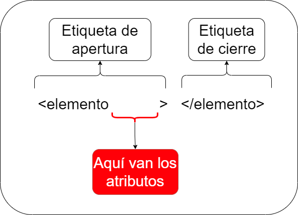

# Variables de referencia o Template Reference

Las variables de referencia son utilizadas para crear referencias asociada a un elemento de nuestro HTML, esto sirve para acceder a sus atributos sin tener que pasar por la lógica (archivo TS), esto es bastante útil para obtener ciertos estados de los elementos y aplicar alguna lógica correspondiente con nuestras directivas estructurales.

Estas variables las usaremos mucho con la directiva de nuestro ngIf, pero también puede ser utilizadas bajo otro contexto, por ejemplo; saber si un input es valido o invalido en su contenido, etc.

Para poder crear una variable de referencia, se hace de la siguiente manera:


En donde se debe utilizar el símbolo **#** (gato, hashtag, almohadilla, etc) seguido del nombre que queramos (nombre debe ser único), de esta manera crearemos una referencia en plantilla.

**Nota :** El nombre de la variable debe estar junto al simbolo **#**

Para usarlo, solo es llamar al nombre que anterior elegimos dentro de un, String Interpolation, Property Binding y Event Binding, sin el símbolo #, solo el nombre, como se muestra a continuación:

```html
<!-- Archivo algún archivo html -->
<input #miPrimeraVariable required name="nombre_secreto">
El nombre del elemento es : {{ miPrimeraVariable.name }}

```

Por ejemplo, aquí estamos haciendo una referencia a un elemento “input” y estamos imprimiendo su atributo “name” por pantalla, se nos vería algo como esto:


Las variables son super útiles, pero hay que tener cuidado, ya que, su nombre no puede existir dos veces, y como son variables, una muy buena usarlas después de su creación y no antes:


# Directivas estructurales

Para este punto hablaremos sobre las directivas **NgIf**, **NgFor**, **NgSwitch** y **NgSwitchCase** y como son sus aplicaciones correspondientes

Antes de comenzar hay que saber, que estas directivas si tienen la capacidad de alterar el **DOM**, ya sea, creando o destruyendo elementos y de ahí su nombre **“Directiva estructurales”**. Estas directivas se usan en el espacio designado para los atributos en un **elemento HTML**, como se muestra en la siguiente imagen:



**Nota:** Para este ejemplo se creará un proyecto nuevo llamado **“directivas_estructurales”**

## Uso de ngIf

**Nota :** para este punto crearemos un componente llamado UsoNgIF y trabajaremos ahí.

Para este ejemplo crearemos un botón que cambie un estado entre verdadero y falso.


 ```typescript
//  Archivo uso-ng-if.component.ts
import { Component } from '@angular/core';

@Component({
  selector: 'app-uso-ng-if',
  templateUrl: './uso-ng-if.component.html',
  styleUrls: ['./uso-ng-if.component.scss']
})
export class UsoNgIFComponent {
  public condicion: boolean = false;

}
 ```

```html
<!-- archivo uso-ng-if.component.html -->
<button (click)="condicion = !condicion">Cambiar estado a {{!condicion}}</button>
```

## Uso de ngIf con condición simple 

Para usar esta característica, deberemos tener en cuenta un resultado condicional o una variable booleana, ya que, el parámetro que se estará evaluando reactivamente siempre deberá devolver un verdadero o falso (true or false).

Para ello, crearemos un elemento párrafo (```<p></p>```) que se muestre cuando la condición sea verdadera, de la siguiente forma:

```html
<!-- Archico uso-ng-if.component.html -->
...
<p  *ngIf="condicion" >Si ves este mensaje es porque la variable condición es verdadera</p>

```

**Nota :** recuerda invocar tu componente, en el componente padre.

```html
<!-- Archivo app.component.html -->
<app-uso-ng-if></app-uso-ng-if>
```

### Resultado 


## Uso de NgIf con else

Para aplicar el **“else”** debemos utilizar una variable de referencia para mostrarla en caso de que la condición de un resultado diferente al esperado, pero hay que tener algo en cuenta, la variable de referencia debe ser creada en el elemento llamado **“ng-template”** que son plantillas que usa angular para estos casos puntuales.

El elemento **“ng-template”** es propia de angular y se usa como referencia para directivas estructurales y con algunas directivas propias de angular, quedando algo como esto:

```html
<!-- Archivo uso-ng-if.component.html -->
...
<hr>
<ng-template #variableParaElse>
  <p>Si ves este mensaje es porque la variable condición es falsa</p>
</ng-template>
<p *ngIf="condicion; else variableParaElse">Si ves este mensaje es porque la variable condición es verdadera</p>
```

### Resultado uso NgIf con Else


**Nota :** Como podemos ver, ahora cuando la variable está en falso, se ve el mensaje que esta dentro de nuestro **“ng-template”** y cuando esta en verdadera se muestra el mensaje proveniente de nuestro **“p”**.

## Uso de then dentro de un ngIf

En algunos casos es necesario usar un elemento como **“pivote”** para nuestras condiciones y en base a su resultado, mostrar elementos complejos o más de uno y para estos casos extremos, tenemos la clausula then, el cual nos permite redirigir a una referencia de plantilla cuando la condición sea verdadera, por ejemplo:

```html
<!-- Archivo uso-ng-if.component.html -->
...
<hr>
<ng-template #variableParaIf>
  <p>Si ves este mensaje es porque la variable condición es verdadera</p>
  <p>Si ves este mensaje es porque la variable condición es verdadera</p>
</ng-template>
<ng-template #otraVariableParaElse>
  <p>Si ves este mensaje es porque la variable condición es falsa</p>
  <p>Si ves este mensaje es porque la variable condición es falsa</p>
</ng-template>
<p  *ngIf="condicion; then variableParaIf else otraVariableParaElse">
  Yo no me mostraré, mi propósito es evaluar el ngIf 😎
</p>
```

Para este ejemplo, se crearon dos **“ng-template”** uno para cuando la **“condición”** se verdadera y otro cuando sea falsa, pero esta vez, para ambos casos, se usará una referencia de plantilla, dando como resultado:

### Resultado uso NgIf con Then y Else


# Uso de ngFor

**Nota :** para este punto crearemos un componente llamado usoNgFor y trabajaremos ahí.

A menudo en una aplicación nos tomaremos una **lista de datos** y tendremos que mostrarlos por pantalla, y para no hacerlo de forma individual, **Angular** nos provee de una **directiva estructural** que es capaz de crear un elemento tantas veces como sea necesaria, esta es la **directiva ngFor**, que nos permite crear **elementos HTML** en base a una **variable Iterable** y acceder a sus propiedades, veamos un ejemplo:

Antes de iniciar con el ejemplo hay que tener en cuenta la estructura que tiene el **NgFor** y son las siguientes:


Para este ejemplo crearemos un ejercicio que contará una lista de elementos de tipo **“Persona”** que, en su estructura, tendrá lo siguiente:

```typescript
interface Persona {
    nombre: string;
    apellido: string;
    edad: number;
}
```

**Nota:** También puedes usar un array de tipos primitivos (number, string, boolean, etc).

**Nota:** Los datos de las personas para este ejemplo esta un archivo llamado **“datos.json”** que esta en la raíz del proyecto que pueden copiar y pegar como valor de su variable Array

```typescript
// Archivo uso-ng-for.component.ts
import { Component } from '@angular/core';

interface Persona {
  nombre: string;
  apellido: string;
  edad: number;
}
@Component({
  selector: 'app-uso-ng-for',
  templateUrl: './uso-ng-for.component.html',
  styleUrls: ['./uso-ng-for.component.scss']
})
export class UsoNgForComponent  {
  public personas: Array<Persona> = //contenido de datos.json

}

```

```html
<!-- Archivo uso-ng-for.component.html -->
<section>
    <p
        *ngFor="let variable of personas"
    >
        Nombre: {{variable.nombre}}
        <br>
        Apellido: {{variable.apellido}}
        <br>
        Edad: {{variable.edad}}
    </p>
</section>
```

Para este **NgFor** crearemos una **variable temporal** que se llamará **“variable”**,el cual, nos servirá para acceder al contenido de la lista en cada **CICLO** y de esta manera acceder a las propiedades de nuestro objeto persona, en donde se imprimirá dentro de una etiqueta párrafo (```<p></p>```), y como nuestra etiqueta párrafo tiene la directiva, se repetirá tantas veces como elementos dentro de la lista.

## Resultado

**Nota:** recuerda invocar nuestro componente “ngUsoFor” para ver el resultado:

```html
<!-- Archivo app.component.html -->
...
<app-uso-ng-for></app-uso-ng-for>
```


Como vemos en nuestro resultado, la etiqueta párrafo (```<p></p>```) se repite tantas veces como elementos en nuestro array.

## Opciones para NgFor

Como vimos en nuestro esquema al inicio, a la directiva **Ngfor** se le pueden pasar opciones separados por puntos y coma **(;)** y las opciones que tenemos son las siguientes:

|Opción|Tipo de dato|Descripción|
|:----|:----|:----|
|Index|Number|Sirve para saber la posición actual al momento de iterar.|
|Count|Number|Sirve para saber la cantidad de elementos que hay en la lista|
|First|Boolean|Sirve para saber si el elemento que se esta iterando es el primero|
|Last|Boolean|Sirve para saber si el elemento que se esta iterando es el último|
|Even|Boolean|Sirve para saber si el index es número par|
|Odd|Boolean|Sirve para saber si el index es número impar|

Para usar estas opciones es necesario renombrarlas usando la cláusula **“as”** como se ve a continuación:

```html
<!-- Archivo uso-ng-for.component.html -->
...
<section>
  <p
    *ngFor="let variable of personas;index as indice; first as primero; last as ultimo; count as cantidad; even as par; odd as impar"
  >
    <span *ngIf="primero">Soy el primer elemento</span>
    <br>
    <span *ngIf="ultimo">Soy el ultimo elemento</span>
    <br>
    Soy el elemento {{ indice }} de {{ cantidad }}
    <br>
    <span *ngIf="par">Soy indice par</span>
    <br>
    <span *ngIf="impar">Soy indice impar</span>
    <br>
    Nombre: {{variable.nombre}}
    <br>
    Apellido: {{variable.apellido}}
    <br>
    Edad: {{variable.edad}}
  </p>
</section>

```

## Resultado
Elemento par


Elemento impar


# Uso de NgSwich NgSwitchCase NgSwitchDefalt
 
**Nota:** para este ejemplo se creará un componente llamado **“usoNgSwitch”**

Este tipo de validación es completamente diferente si la comparamos con la directiva NgIf, ya que, su forma de funcionar es por “casos”, por lo tanto, se usa cuando los valores que se están evaluando son conocidos y no muchos, ya que, aquí no van “condiciones” si no valores.

Para realizar un ejemplo, aplicaremos una variable **“string”** que cambie cuando un **select** lo disponga, de esta manera usando **NgSwitch** y **NgSwitchCase** mostraremos o ocultaremos elementos en base a las coincidencias.

```typescript
// Archivo uso-ng-switch.component.ts
import { Component } from '@angular/core';

@Component({
  selector: 'app-uso-ng-switch',
  templateUrl: './uso-ng-switch.component.html',
  styleUrls: ['./uso-ng-switch.component.scss']
})
export class UsoNgSwitchComponent  {
  public opciones: Array<string> = [
    '🍕',
    '🍔',
    '🍟',
    '🌭',
    '🍿',
  ]

  public seleccion: string = 'Nada';

  public cambiarSeleccion({ target }: Event): void {
    const elemento = target as HTMLInputElement;
    this.seleccion = elemento.value;
  }

}
```

```html
<!-- Archivo uso-ng-switch.component.html -->
<select [value]="seleccion" (change)="cambiarSeleccion($event)">
  <option value="Nada">No tengo gusto</option>
  <option *ngFor="let item of opciones" [value]="item">{{item}}</option>
</select>

<section [ngSwitch]="seleccion">
  <p *ngSwitchCase="'🍕'">Te gusta la pizza :D</p>
  <p *ngSwitchCase="'🍔'">Te gusta la hamburguesa :o</p>
  <p *ngSwitchCase="'🍟'">Te gusta las papitas :P</p>
  <p *ngSwitchCase="'🌭'">Nunca es malo un completo</p>
  <p *ngSwitchCase="'🍿'">Un helado de vainilla</p>
  <p *ngSwitchDefault>Veo que no tienes ningún gusto :o</p>
</section>
```

**Nota:** Para usar la directiva **NgSwitch** debe existir un contenedor y se hace mediante **Property Binding ([])** y los diferentes casos se llama la directiva NgSwitchCase o NgSwichDefault anteponiendo un asterisco **(*)**.

Como podemos ver en el código anterior, tenemos una lista controlada en donde podemos poner código para cada caso, y para todo el resto que no coincida con los casos anteriores se aplicará lo que esta dentro del **ngSwitchDefault**, que se comportaría como un **“else”**


## Resultado

**Nota:** recuerda invocar nuestro componente ngUsoSwitch para ver el resultado:

```html
<!-- Archivo app.component.html -->
...
<app-uso-ng-switch></app-uso-ng-switch>
```

