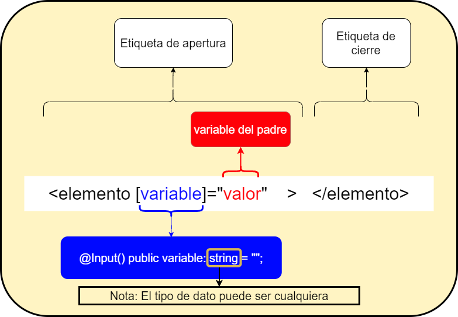
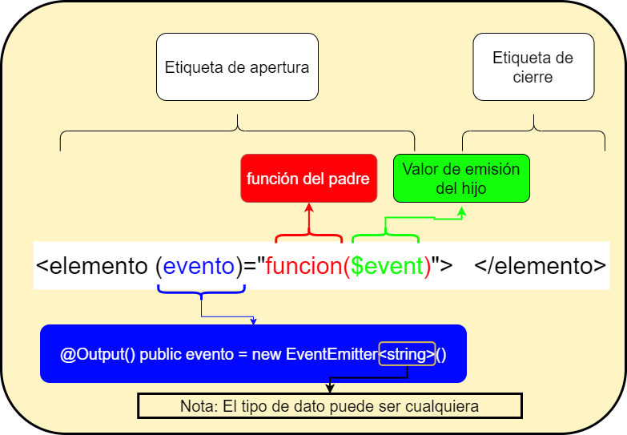

# Comunicación entre componentes

Hasta el momento hemos trabajado con diferentes componentes individuales, en donde, cada uno de ello hace su trabajo puntual sin más, pero desde aquí salen algunas incógnitas y son:

* ¿Podré pasar datos a un componente hijo desde un padre? 
* ¿Podré recibir datos desde un componente hijo hacia un padre?

Pero para resolver estas dudas, recordemos un poco como funciona una estructura **HTML**. Hay que recordar que, en **HTML**, hay muchos elementos y algunos de ellos están dentro de otro provocando una **“jerarquía”**, y se ve algo así:


En donde tenemos elementos **hijos**, **hijos de hijos**, **elementos padres**, etc. Y los componentes en como lo hemos conocido hasta el momento podemos decir que se comportan de esta manera:


Como podemos ver, independientemente estemos usando **“componentes”** con **Angular**, las jerarquías de HTML se mantienen, ya que, los componentes, se invocan como una etiqueta común y corriente, pero **tienen super poderes**. 

Por lo tanto, respondiendo a las preguntas anteriores, es Sí para ambas.

## Entrada de datos (Input)

Con **Angular**, podemos pasar **parámetros** desde un componente padre hacia un Hijo usando una característica llamada **“Custom Property”** que consiste en crear un atributo completamente nuevo en base a una propiedad (variable, propiedad, atributo) de componente (archivo TS), veamos el siguiente ejemplo:


Para la entrada de datos, usaremos un componente llamado **“contador”** que recibirá por **Custom Property** (atributo personalizado) a una variable llamada **“valorInicial”** y desde ahí empezará a contar cada vez que se pinche un botón.

Para lograr que un componente reciba un parámetro tendremos que importar un decorador llamado **“Input**”, con este decorador lograremos que la **variable** que esta siendo **decorada** pueda ser recibida por parámetro, aquí un ejemplo:

**Nota:** Un decorador sirve para añadirle nuevas funcionalidades a una Clase, Atributo, Función.



Para importar el decorador “Input” se hace desde “@angular/core” de la siguiente manera:

```typescript
import {… , Input } from '@angular/core';
```

Veamos como quedaría nuestro componente, con su parámetro de entrada **“valorInicial”**

```typescript
// Archivo contador.component.html
import { Component, Input } from '@angular/core';

@Component({
  selector: 'app-contador',
  templateUrl: './contador.component.html',
  styleUrls: ['./contador.component.scss']
})
export class ContadorComponent  {
  @Input() public valorInicial: number = 0;
}

```

```html
<!-- Archivo contador.component.html -->
Soy un hijo <br>
La variable <pre style="display: inline;">valorInicial</pre> es : {{ valorInicial }}
<br>
<button>Aumentar</button>
```

Invocamos nuestro componente en nuestro padre, Componente App, quedaría algo como esto:

```html
<!-- Archivo App.component.html -->
<app-contador></app-contador>
<hr>
<app-contador></app-contador>
```
Yo lo invoque dos veces haciendo alusión al diagrama que esta un poco mas arriba, si miramos nuestra web, tendríamos algo como esto:

### Resultado parametros de entrada


En nuestro padre, creemos dos variables numerales para poder pasarlas por parámetro a nuestros hijos y ver el resultado:

```typescript
// Archivo app.component.ts
import { Component } from '@angular/core';

@Component({
  selector: 'app-root',
  templateUrl: './app.component.html',
  styleUrls: ['./app.component.scss']
})
export class AppComponent {
  public contadorUno: number = 30;
  public contadorDos: number = 40;
}
```
```html
<!-- Archivo app.component.html -->
<app-contador [valorInicial]="contadorUno"></app-contador>
<hr>
<app-contador [valorInicial]="contadorDos"></app-contador>
```
Como podemos apreciar, estamos invocando la variable que fue decorada con **Input**, en este caso la variable se llama **“valorInicial”**, mediante el uso de **Property Binding** selecciono la variable decorada del Hijo y le mando la variable del padre llamada **“contadorUno”** **“contadorDos”** a cada uno de los hijos, resultado por pantalla:


Ahí esta nuestra variable, pintada por pantalla, es maravillo como funciona la comunicación entre componentes, ahora para hacerlo funcionar crearemos que nuestro hijo emita un evento personalizado (Custom Event) y escuchar dicho evento desde el padre.

## Emisión de eventos (Output)

Con Angular, podemos pasar recibir desde un **componente hijo** hacia **un padre** usando una característica llamada “Custom Event” que consiste en crear un evento completamente nuevo en base a una propiedad (variable, propiedad, atributo) de componente (archivo TS), veamos el siguiente ejemplo:


Para la salida de datos, usaremos el componente anterior creado llamado **“contador”** que ahora emitirá un **Evento Personalizado** **(Custom Event)** con un dato nuevo que será la variable **“valorInicial”** incrementado en uno, desde ahí empezaremos a aumentar nuestra variable cada vez que el botón se pinche.

Para lograr que un componente hijo emita un evento, tendremos que importar un decorador llamado **“Output”** y la Clase **“EventEmitter”**, con este decorador e instancia de la Clase lograremos que nuestro componente hijo emita un evento personalizado.



Para importar el decorador **“Output”** y la Clase **“EventEmitter”** se hace de **“@angular/core”**, con el siguiente código:

```typescript
import {…, Output, EventEmitter } from '@angular/core';
```

Veamos como quedaría nuestro componente **“contador”** con su emisión de evento, nuestro evento se llamará **“nuevoValor”**

```typescript
// Archivo contador.component.ts
import { Component, Input, Output, EventEmitter } from '@angular/core';

@Component({
  selector: 'app-contador',
  templateUrl: './contador.component.html',
  styleUrls: ['./contador.component.scss']
})
export class ContadorComponent  {
  @Input() public valorInicial: number = 0;
  @Output() nuevoValor= new EventEmitter<number>();

  public emitirAumento(): void {
    this.nuevoValor.emit(this.valorInicial + 1);
  }
}
```

```html
<!-- Archivo contador.component.html -->
Soy un hijo <br>
La variable <pre style="display: inline;">valorInicial</pre> es : {{ valorInicial }}
<br>
<button (click)="emitirAumento()">Aumentar</button>
```

Con esto, cada vez que se pinche el botón, se ejecutará la función llamada **“emitirAumento”** en donde esta función emitirá el evento llamado **“nuevoValor”** con el valor de **“valorInicial”** aumentado en uno.

Ahora desde el padre, debemos escuchar dicho evento usando la característica **Event Bindig** de nuestro evento personalizado llamado **“nuevoValor”** y con la variable **“$event”** podemos recibir los datos que este evento está emitiendo.

**Nota:** la variable **$event** se encarga de recibir los datos emitidos por el hijo o objeto emitido para eventos nativos del HTML

```typescript
// Archivo app.component.ts
import { Component } from '@angular/core';

@Component({
  selector: 'app-root',
  templateUrl: './app.component.html',
  styleUrls: ['./app.component.scss']
})
export class AppComponent {
  public contadorUno: number = 30;
  public contadorDos: number = 40;

  public escucharHijoUno(valor: number): void {
    this.contadorUno = valor;
  }
  public escucharHijoDos(valor: number): void {
    this.contadorDos = valor;
  }
}

```

```html
<!-- Archivo app.component.html -->
<app-contador
  [valorInicial]="contadorUno"
  (nuevoValor)="escucharHijoUno($event)"
></app-contador>
<hr>
<app-contador
  [valorInicial]="contadorDos"
  (nuevoValor)="escucharHijoDos($event)"
></app-contador>

```
### Resultado


Finalizando el ejercicio, los componentes pueden tener comunicación entre padres e hijos gracias a las características **Property Binding** (Para la entrada) y **Event Binding** (Para la salida), permitiéndonos crear **atributos** y **eventos personalizados** para cada componente, abriendo mucho mas las posibilidades de reutilización de cada componente en tu desarrollo.
